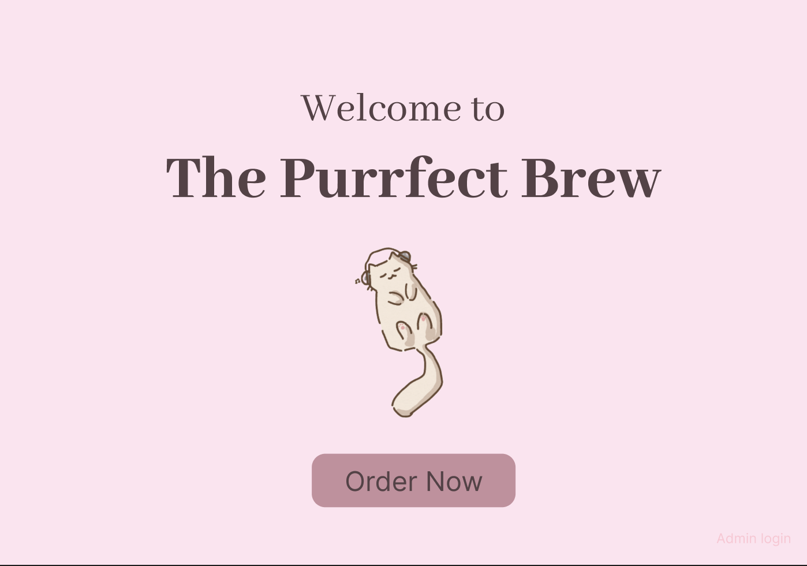
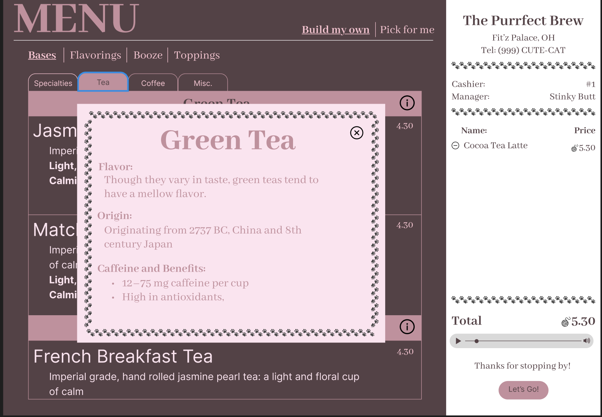

# Home Bar
A webapp designed to run on my ipad to keep track of my drink recipes and what drinks are possible to make based on what's in stock. Also allows for customization of drinks and an assistant to help create new drinks.

## Design
Concept designs created in Figma

### Welcome page

### Build my own drink page

### Build my own drink page with sub categories

### Information Modal

## Database stored in Notion

Notion offers free storage that can easily be adjusted from an already created ui and already stores my recipes so I chose to stick with this for the rest of my storage to save on costs, limit what I have to implement to initially roll out the project and to allow my general recipe storage to remain up to date with any new drinks.